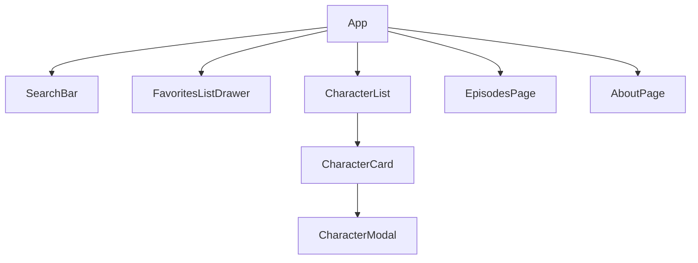
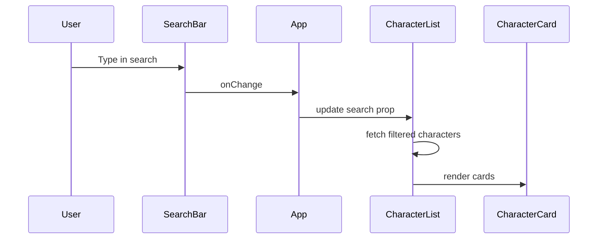
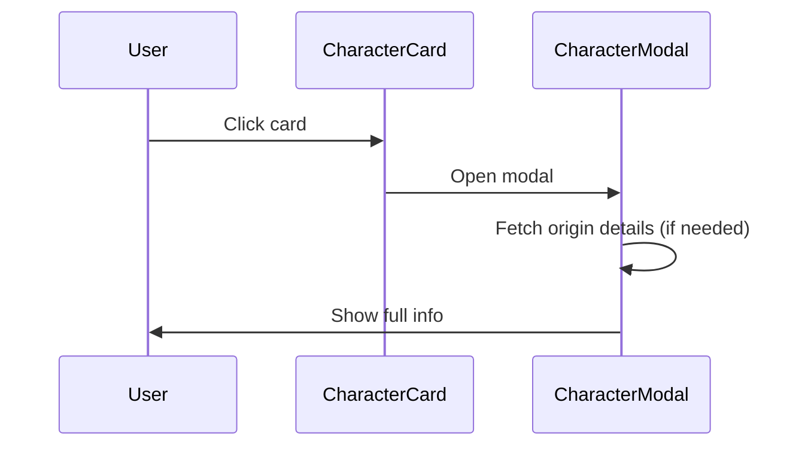
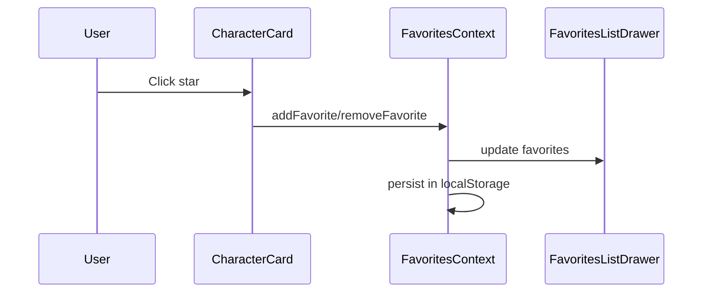
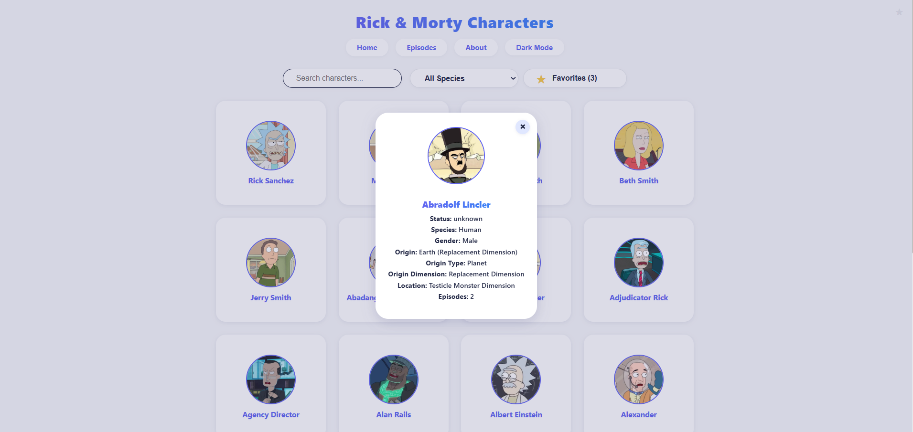
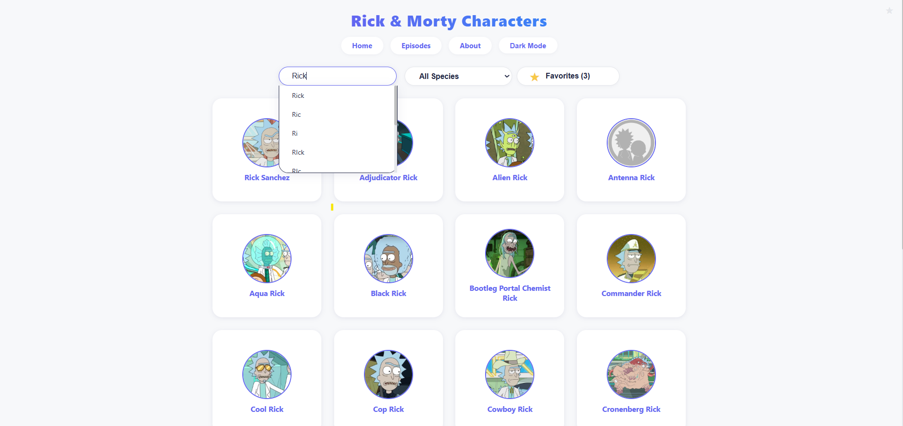
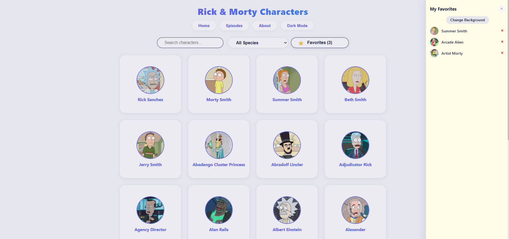
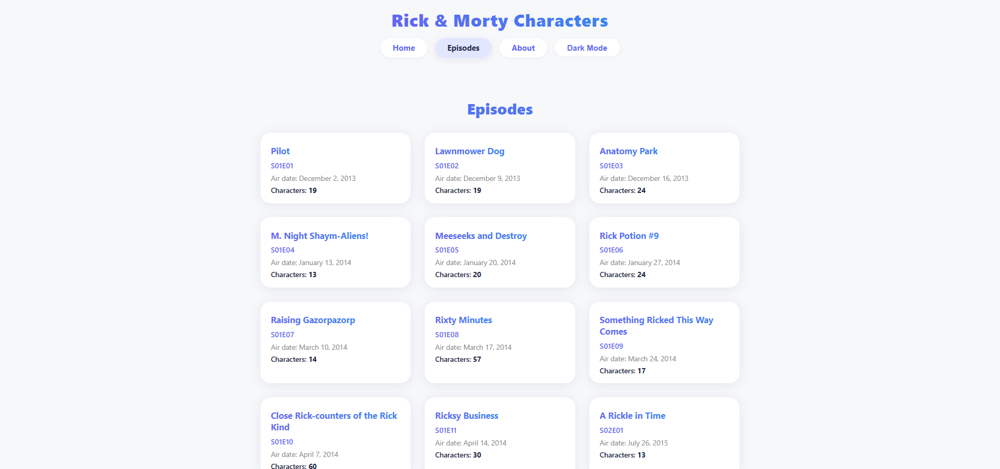

# Rick & Morty React App

A modern React + TypeScript app to explore Rick & Morty characters and episodes, with favorites, search, filters, dark/light mode, and more.

---

## 1. How to Run the Application

1. Clone the repo
2. `cd my-app`
3. `npm install`
4. `npm start`

The app will run at [http://localhost:3000](http://localhost:3000)

---

## 2. Breakdown of Components

- **App.tsx** – Main app shell, routing, layout, dark mode, and context providers.
- **CharacterList** – Fetches and displays a paginated list of characters (with search/filter).
- **CharacterCard** – Displays a single character (name, image, favorite button).
- **CharacterModal** – Modal with full character details (name, status, species, gender, episodes, origin details).
- **SearchBar** – Search input with history dropdown.
- **FavoritesListDrawer** – Drawer showing favorite characters, with remove and background toggle.
- **EpisodesPage** – Paginated list of episodes.
- **AboutPage** – Info about the app and the series.

---

## 3. Services

### API Service
- **characterService.ts** – Fetches characters (with pagination, search, filter).
- **episodeService.ts** – Fetches episodes (with pagination).

### State Management
- **FavoritesContext.tsx** – Manages favorite characters (add/remove, persist in localStorage).
- **App.tsx** – Manages search, search history, dark mode, and species filter (local state).

---

## 4. Interaction Flow Diagram

### Component Render

### Search

### Modal Interaction

### Favorites Management

---

## 5. Screenshots

### Home Page

*Main page with character cards, search bar, and species filter*

### Character Card

*Individual character card with name, image, and favorite button*

### Character Modal

*Detailed character modal with all information including origin details*

### Search Functionality

*Search feature with filtered results*

### Favorites Drawer

*Favorites drawer showing saved characters*

### Episodes Page

*Episodes page with paginated list*

### About Page

*About page with information about the app and series*

---

## API
- [Rick and Morty API](https://rickandmortyapi.com/)

